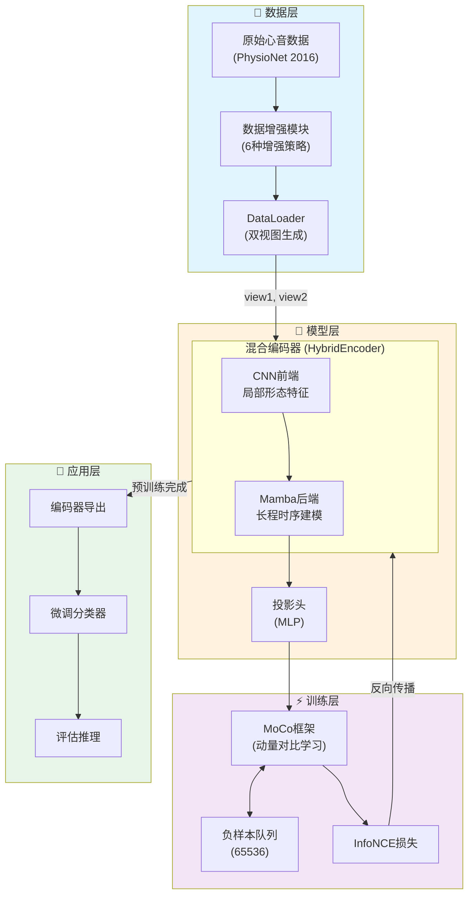
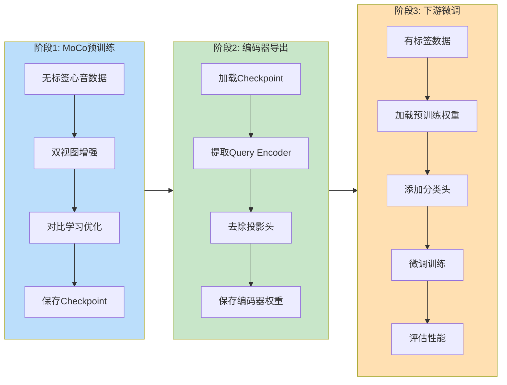
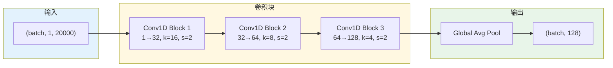
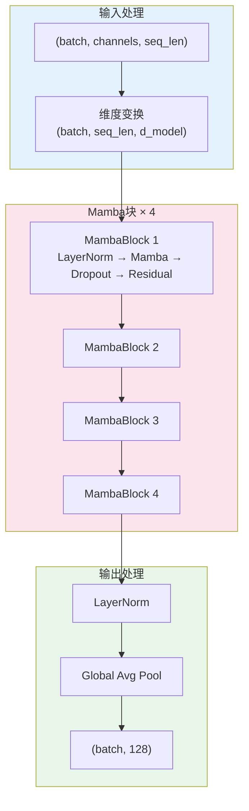
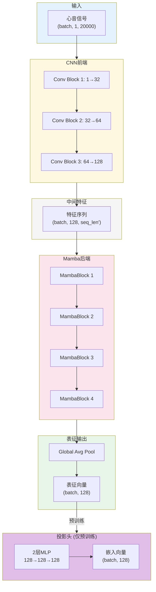
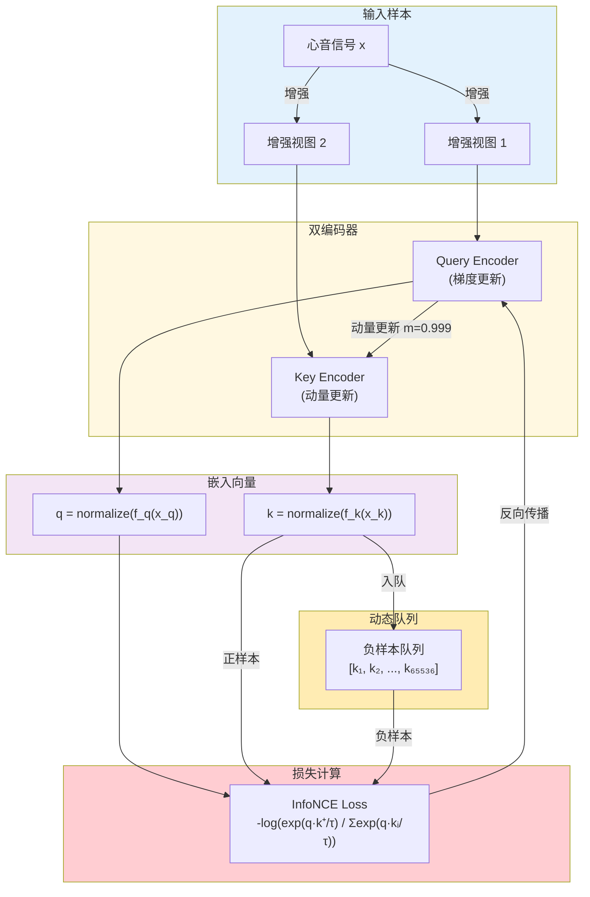
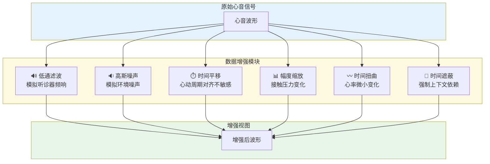
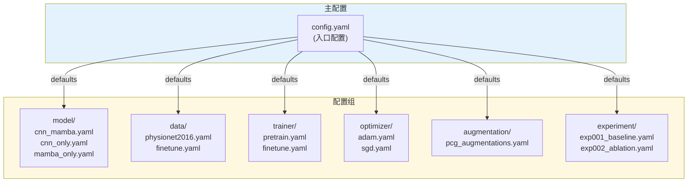
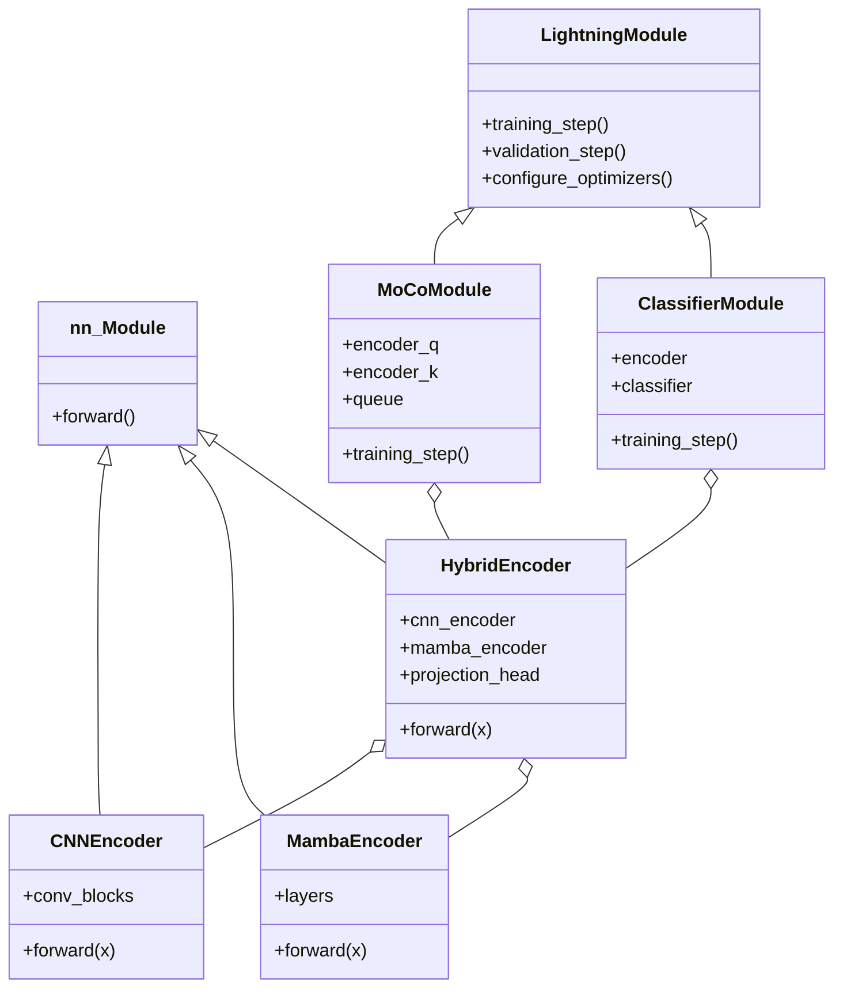

# CNN-Mamba-SSL 项目技术说明文档

> **基于自监督对比学习与CNN-Mamba融合编码器的心音表征学习与疾病分类研究**

---

## 目录

1. [项目概述](#1-项目概述)
2. [系统整体架构](#2-系统整体架构)
3. [编码器架构详解](#3-编码器架构详解)
4. [MoCo自监督学习框架](#4-moco自监督学习框架)
5. [数据增强策略](#5-数据增强策略)
6. [损失函数](#6-损失函数)
7. [配置系统](#7-配置系统)
8. [代码模块结构](#8-代码模块结构)
9. [性能基准](#9-性能基准)
10. [技术参考](#10-技术参考)

---

## 1. 项目概述

### 1.1 研究背景

心音信号（Phonocardiogram, PCG）是心脏活动产生的声学信号，包含丰富的心脏健康诊断信息。传统的心音分类方法依赖于大量人工标注的数据，但医学数据标注成本高昂且需要专业知识。

**核心挑战：**
- 医学数据标注成本高，专家资源稀缺
- 心音信号具有复杂的时序结构和形态特征
- 不同采集设备、环境条件导致数据分布差异大

### 1.2 核心目标

本项目旨在通过**自监督对比学习**从大规模无标签心音数据中学习高质量特征表示，然后迁移到下游分类任务，从而：

1. **降低标注依赖**：利用无标签数据进行预训练
2. **提升分类性能**：学习到的表征可有效区分正常与异常心音
3. **增强泛化能力**：通过数据增强和对比学习提升模型鲁棒性

### 1.3 技术创新点

| 创新点 | 技术方案 | 优势 |
|--------|----------|------|
| **混合编码器架构** | CNN前端 + Mamba后端串行融合 | 同时捕捉局部形态特征和长程时序依赖 |
| **MoCo动量对比学习** | 动态队列维护65536负样本 | 突破mini-batch限制，获得更好的负样本覆盖 |
| **心音专用数据增强** | 6种针对性增强策略 | 模拟真实临床场景下的信号变化 |
| **高效时序建模** | Mamba状态空间模型 | O(L)线性复杂度，高效处理长序列 |

### 1.4 技术栈

```
深度学习框架: PyTorch 2.0+
训练框架: PyTorch Lightning 2.0+
配置管理: Hydra 1.3+
时序建模: Mamba-SSM 1.0+
音频处理: librosa 0.10+
评估指标: torchmetrics 1.0+
```

---

## 2. 系统整体架构

### 2.1 系统架构图



### 2.2 训练流程概览



---

## 3. 编码器架构详解

### 3.1 CNN编码器 (CNNEncoder)

**功能定位**：提取心音信号的**局部形态特征**，包括S1/S2心音波形、心杂音纹理等。

#### 3.1.1 架构设计



#### 3.1.2 卷积块结构

每个卷积块（`ConvBlock`）包含以下组件：

```
Conv1D → BatchNorm1D → ReLU → Dropout(0.1)
```

#### 3.1.3 设计理念

| 层级 | 通道数 | 卷积核 | 感受野 | 捕捉特征 |
|------|--------|--------|--------|----------|
| Block 1 | 32 | 16 | 大 | 心音包络、周期结构 |
| Block 2 | 64 | 8 | 中 | S1/S2波形细节 |
| Block 3 | 128 | 4 | 小 | 心杂音纹理、高频成分 |

**渐小卷积核策略**：从宏观包络逐步过渡到微观纹理特征。

#### 3.1.4 关键代码

```python
# 位置: src/models/encoders/cnn_encoder.py
class CNNEncoder(nn.Module):
    def __init__(
        self,
        in_channels: int = 1,
        out_channels: List[int] = [32, 64, 128],
        kernel_sizes: List[int] = [16, 8, 4],
        strides: List[int] = [2, 2, 2],
        use_batchnorm: bool = True,
        dropout: float = 0.1
    ):
        # 渐进式通道扩张，渐小卷积核
        ...
```

### 3.2 Mamba编码器 (MambaEncoder)

**功能定位**：以**线性复杂度O(L)**捕捉心音信号的**长程时序依赖**，分析心动周期节律和时序演变模式。

#### 3.2.1 架构设计



#### 3.2.2 Mamba状态空间模型

Mamba是一种选择性状态空间模型（Selective SSM），其核心优势：

| 特性 | Transformer | Mamba |
|------|-------------|-------|
| 时间复杂度 | O(L²) | O(L) |
| 空间复杂度 | O(L²) | O(L) |
| 长序列处理 | 受限于显存 | 高效处理 |
| 因果建模 | 需要掩码 | 天然因果 |

#### 3.2.3 关键参数

| 参数 | 默认值 | 说明 |
|------|--------|------|
| `d_model` | 128 | 模型隐藏维度 |
| `d_state` | 16 | SSM状态维度（控制记忆容量） |
| `d_conv` | 4 | 局部卷积宽度（短程依赖） |
| `expand` | 2 | 内部维度扩展因子 |
| `n_layers` | 4 | Mamba块堆叠层数 |
| `dropout` | 0.1 | Dropout比率 |

#### 3.2.4 关键代码

```python
# 位置: src/models/encoders/mamba_encoder.py
class MambaEncoder(nn.Module):
    def __init__(
        self,
        d_model: int = 128,
        d_state: int = 16,
        d_conv: int = 4,
        expand: int = 2,
        n_layers: int = 4,
        dropout: float = 0.1
    ):
        self.layers = nn.ModuleList([
            MambaBlock(d_model, d_state, d_conv, expand, dropout)
            for _ in range(n_layers)
        ])
```

### 3.3 混合编码器 (HybridEncoder)

**功能定位**：融合CNN和Mamba的优势，实现**形态+节律**特征的协同提取。

#### 3.3.1 串行融合架构



#### 3.3.2 设计理念

**为什么采用串行而非并行？**

| 架构 | 优势 | 劣势 |
|------|------|------|
| **串行（本项目）** | CNN降采样后Mamba处理更短序列，计算高效 | 信息传递是单向的 |
| 并行 | 两种特征独立提取 | 需要融合策略，计算量翻倍 |

**串行优势**：
1. CNN先进行降采样，减少Mamba处理的序列长度
2. Mamba在CNN提取的特征上建模，而非原始信号
3. 参数更少，训练更稳定

#### 3.3.3 投影头 (ProjectionHead)

投影头用于将编码器输出映射到对比学习空间：

```python
# 位置: src/models/encoders/hybrid_encoder.py
class ProjectionHead(nn.Module):
    def __init__(self, input_dim=128, hidden_dim=128, output_dim=128):
        self.layers = nn.Sequential(
            nn.Linear(input_dim, hidden_dim),
            nn.ReLU(),
            nn.Linear(hidden_dim, output_dim)
        )
```

**注意**：投影头仅在预训练阶段使用，微调时丢弃。

---

## 4. MoCo自监督学习框架

### 4.1 MoCo核心思想

MoCo（Momentum Contrast）是一种基于对比学习的自监督方法，核心思想是：
- 将同一样本的两个增强视图视为**正样本对**
- 将不同样本的视图视为**负样本**
- 通过拉近正样本、推远负样本来学习特征表示

### 4.2 MoCo v2架构



### 4.3 关键机制详解

#### 4.3.1 动量更新

Key Encoder不通过梯度更新，而是通过动量方式从Query Encoder缓慢更新：

$$\theta_k \leftarrow m \cdot \theta_k + (1-m) \cdot \theta_q$$

其中 $m = 0.999$ 是动量系数。

**优势**：保持Key Encoder的一致性，避免负样本表示快速变化。

#### 4.3.2 动态队列

| 特性 | 说明 |
|------|------|
| 队列大小 | 65536（远大于batch size） |
| 更新方式 | FIFO（先进先出） |
| 作用 | 提供大量负样本，增强对比学习效果 |

#### 4.3.3 Shuffle BN（分布式训练）

在多GPU训练时，Batch Normalization可能导致信息泄露。MoCo通过打乱-恢复机制解决：

```python
@torch.no_grad()
def _batch_shuffle_ddp(self, x):
    # 跨GPU打乱batch顺序
    ...

@torch.no_grad()
def _batch_unshuffle_ddp(self, x, idx_unshuffle):
    # 恢复原始顺序
    ...
```

### 4.4 MoCo关键参数

| 参数 | 默认值 | 说明 | 调优建议 |
|------|--------|------|----------|
| `queue_size` | 65536 | 负样本队列大小 | 越大越好，受显存限制 |
| `momentum` | 0.999 | 动量系数 | 通常固定 |
| `temperature` | 0.07 | 温度参数 | 较小值产生更尖锐分布 |
| `use_mlp` | True | 是否使用投影头 | 建议开启（MoCo v2改进） |

### 4.5 训练步骤伪代码

```python
# 位置: src/models/moco_module.py
def training_step(self, batch, batch_idx):
    # 1. 获取双视图
    im_q, im_k = batch
    
    # 2. Query Encoder前向传播
    q = self.encoder_q(im_q)
    q = F.normalize(q, dim=1)
    
    # 3. Key Encoder前向传播（无梯度）
    with torch.no_grad():
        self._momentum_update_key_encoder()
        k = self.encoder_k(im_k)
        k = F.normalize(k, dim=1)
    
    # 4. 计算InfoNCE损失
    loss = self.criterion(q, k, self.queue)
    
    # 5. 更新队列
    self._dequeue_and_enqueue(k)
    
    return loss
```

---

## 5. 数据增强策略

### 5.1 增强策略概览

本项目针对心音信号特性设计了6种数据增强策略：



### 5.2 各增强策略详解

#### 5.2.1 低通滤波 (LowPassFilter) ⭐⭐⭐⭐⭐

**重要性**：最关键的增强策略！

| 属性 | 说明 |
|------|------|
| **原理** | 使用Butterworth滤波器衰减高频成分 |
| **模拟场景** | 不同听诊器的频率响应特性差异 |
| **参数** | 截止频率200-500Hz，滤波器阶数5 |

```python
# 位置: src/data/datasets/augmentations.py
class LowPassFilter(PCGAugmentation):
    def apply(self, audio):
        cutoff_freq = np.random.uniform(200, 500)  # Hz
        nyquist = self.sr / 2
        normalized_cutoff = cutoff_freq / nyquist
        b, a = signal.butter(self.filter_order, normalized_cutoff, btype='low')
        return signal.filtfilt(b, a, audio)
```

#### 5.2.2 高斯噪声 (GaussianNoise) ⭐⭐⭐⭐

| 属性 | 说明 |
|------|------|
| **原理** | 添加随机高斯白噪声 |
| **模拟场景** | 环境噪声、设备电子噪声 |
| **参数** | 噪声标准差0.001-0.01 |

#### 5.2.3 时间平移 (TimeShift) ⭐⭐⭐⭐

| 属性 | 说明 |
|------|------|
| **原理** | 循环移动信号起始位置 |
| **目的** | 使模型对心动周期起始位置不敏感 |
| **参数** | 最大偏移±0.5秒 |

#### 5.2.4 幅度缩放 (AmplitudeScale) ⭐⭐⭐

| 属性 | 说明 |
|------|------|
| **原理** | 随机缩放信号幅度 |
| **模拟场景** | 听诊器接触压力变化 |
| **参数** | 缩放范围0.8-1.2 |

#### 5.2.5 时间扭曲 (TimeWarp) ⭐⭐⭐

| 属性 | 说明 |
|------|------|
| **原理** | 非线性拉伸/压缩时间轴 |
| **模拟场景** | 心率的微小变化 |
| **参数** | 扭曲强度0.1 |

#### 5.2.6 时间遮蔽 (TimeMasking) ⭐⭐⭐

| 属性 | 说明 |
|------|------|
| **原理** | 随机将部分时间段置零 |
| **目的** | 强制模型依赖上下文信息重建 |
| **参数** | 最大遮蔽长度0.2秒，最多3段 |

### 5.3 增强组合策略

```python
# 位置: src/data/datasets/augmentations.py
class PCGAugmentationPipeline:
    def __init__(self, augmentations, p=0.5, max_augs=4):
        self.augmentations = augmentations
        self.p = p           # 每种增强的应用概率
        self.max_augs = max_augs  # 最多同时应用的增强数量
    
    def __call__(self, audio):
        # 随机选择子集增强
        selected = [aug for aug in self.augmentations 
                    if random.random() < self.p]
        selected = selected[:self.max_augs]
        
        for aug in selected:
            audio = aug(audio)
        return audio
```

### 5.4 增强配置示例

```yaml
# 位置: configs/augmentation/pcg_augmentations.yaml
lowpass_filter:
  enabled: true
  prob: 0.5
  cutoff_freq_range: [200, 500]
  filter_order: 5

gaussian_noise:
  enabled: true
  prob: 0.5
  noise_level_range: [0.001, 0.01]

time_shift:
  enabled: true
  prob: 0.5
  max_shift: 0.5  # 秒

amplitude_scale:
  enabled: true
  prob: 0.5
  scale_range: [0.8, 1.2]

time_warp:
  enabled: true
  prob: 0.3
  warp_strength: 0.1

time_masking:
  enabled: true
  prob: 0.3
  max_mask_length: 0.2  # 秒
  max_masks: 3
```

---

## 6. 损失函数

### 6.1 InfoNCE损失

InfoNCE（Noise Contrastive Estimation）是对比学习的核心损失函数：

$$\mathcal{L} = -\log\frac{\exp(q \cdot k^+ / \tau)}{\exp(q \cdot k^+ / \tau) + \sum_{i=1}^{K}\exp(q \cdot k_i^- / \tau)}$$

其中：
- $q$：Query embedding（来自Query Encoder）
- $k^+$：Positive key embedding（同一样本的另一增强视图）
- $k_i^-$：Negative key embeddings（队列中的负样本）
- $\tau$：温度参数（控制分布尖锐程度）
- $K$：负样本数量（队列大小）

### 6.2 温度参数的作用

| 温度 $\tau$ | 效果 |
|-------------|------|
| 较小（如0.07） | 分布更尖锐，对困难负样本更敏感 |
| 较大（如1.0） | 分布更平滑，对所有负样本更均匀 |

### 6.3 实现代码

```python
# 位置: src/losses/info_nce.py
class InfoNCELoss(nn.Module):
    def __init__(self, temperature: float = 0.07):
        self.temperature = temperature
    
    def forward(self, q, k, queue):
        # 正样本相似度: (batch, 1)
        l_pos = torch.einsum('nc,nc->n', [q, k]).unsqueeze(-1)
        
        # 负样本相似度: (batch, queue_size)
        l_neg = torch.einsum('nc,ck->nk', [q, queue.clone().detach()])
        
        # 拼接 logits: (batch, 1 + queue_size)
        logits = torch.cat([l_pos, l_neg], dim=1) / self.temperature
        
        # 标签：正样本在第0位
        labels = torch.zeros(logits.shape[0], dtype=torch.long, device=logits.device)
        
        return F.cross_entropy(logits, labels)
```

---

## 7. 配置系统

### 7.1 Hydra分层配置架构



### 7.2 配置文件说明

#### 7.2.1 主配置 (config.yaml)

```yaml
defaults:
  - model: cnn_mamba          # 模型配置
  - data: physionet2016       # 数据配置
  - trainer: pretrain         # 训练器配置
  - optimizer: adam           # 优化器配置
  - augmentation: pcg_augmentations  # 增强配置
  - _self_

# 全局配置
seed: 42
data_dir: ${oc.env:PWD}/dataset
output_dir: ${oc.env:PWD}/outputs
log_dir: ${oc.env:PWD}/logs
```

#### 7.2.2 模型配置 (model/cnn_mamba.yaml)

```yaml
_target_: src.models.encoders.hybrid_encoder.HybridEncoder

cnn_config:
  in_channels: 1
  out_channels: [32, 64, 128]
  kernel_sizes: [16, 8, 4]
  strides: [2, 2, 2]
  use_batchnorm: true
  dropout: 0.1

mamba_config:
  d_model: 128
  d_state: 16
  d_conv: 4
  expand: 2
  n_layers: 4
  dropout: 0.1

projection_config:
  input_dim: 128
  hidden_dim: 128
  output_dim: 128
  num_layers: 2
```

#### 7.2.3 数据配置 (data/physionet2016.yaml)

```yaml
_target_: src.data.datamodules.pretrain_datamodule.PretrainDataModule

data_dir: ${data_dir}/预训练大规模数据集/PhysioNetCinC Challenge 2016 Database
target_sr: 4000              # 目标采样率
segment_length: 5.0          # 片段长度（秒）
n_samples: 20000             # 样本点数 = target_sr × segment_length

train_ratio: 0.8
val_ratio: 0.1
test_ratio: 0.1

batch_size: 64
num_workers: 4
pin_memory: true
use_dual_augmentation: true  # MoCo双视图模式
```

#### 7.2.4 训练器配置 (trainer/pretrain.yaml)

```yaml
trainer:
  _target_: pytorch_lightning.Trainer
  max_epochs: 200
  accelerator: auto
  devices: auto
  precision: 16-mixed        # 混合精度训练
  gradient_clip_val: 1.0
  log_every_n_steps: 50
  
callbacks:
  model_checkpoint:
    _target_: pytorch_lightning.callbacks.ModelCheckpoint
    dirpath: ${output_dir}/checkpoints
    filename: "epoch={epoch}-val_loss={val_loss:.4f}"
    monitor: val_loss
    mode: min
    save_top_k: 3
    save_last: true
  
  early_stopping:
    _target_: pytorch_lightning.callbacks.EarlyStopping
    monitor: val_loss
    patience: 20
    mode: min
```

#### 7.2.5 优化器配置 (optimizer/adam.yaml)

```yaml
optimizer:
  _target_: torch.optim.Adam
  lr: 0.001
  weight_decay: 0.0001

scheduler:
  _target_: torch.optim.lr_scheduler.CosineAnnealingLR
  T_max: ${trainer.trainer.max_epochs}
  eta_min: 0.00001
```

### 7.3 命令行覆盖

Hydra支持通过命令行覆盖任意配置：

```bash
# 修改学习率和batch size
python scripts/train_pretrain.py \
    optimizer.optimizer.lr=0.0005 \
    data.batch_size=128

# 切换模型架构
python scripts/train_pretrain.py model=mamba_only

# 多配置扫描（消融实验）
python scripts/train_pretrain.py -m \
    model=cnn_only,mamba_only,cnn_mamba

# 使用实验配置
python scripts/train_pretrain.py experiment=exp001_baseline
```

### 7.4 配置速查表

| 配置路径 | 说明 | 典型值 |
|----------|------|--------|
| `model.mamba_config.n_layers` | Mamba层数 | 4 |
| `model.mamba_config.d_model` | 隐藏维度 | 128 |
| `data.batch_size` | 批次大小 | 64 |
| `data.target_sr` | 采样率 | 4000 |
| `trainer.trainer.max_epochs` | 最大轮数 | 200 |
| `trainer.trainer.precision` | 精度 | 16-mixed |
| `optimizer.optimizer.lr` | 学习率 | 0.001 |
| `moco.queue_size` | 队列大小 | 65536 |
| `moco.temperature` | 温度 | 0.07 |

---

## 8. 代码模块结构

### 8.1 项目目录树

```
CNN-Mamba-SSL/
├── configs/                    # Hydra配置文件
│   ├── config.yaml            # 主配置入口
│   ├── model/                 # 模型配置
│   ├── data/                  # 数据配置
│   ├── trainer/               # 训练器配置
│   ├── optimizer/             # 优化器配置
│   ├── augmentation/          # 增强配置
│   └── experiment/            # 实验配置
│
├── src/                       # 源代码
│   ├── __init__.py
│   ├── models/                # 模型模块
│   │   ├── __init__.py
│   │   ├── moco_module.py     # MoCo Lightning Module
│   │   ├── classifier_module.py  # 分类器 Module
│   │   └── encoders/          # 编码器
│   │       ├── cnn_encoder.py
│   │       ├── mamba_encoder.py
│   │       └── hybrid_encoder.py
│   │
│   ├── data/                  # 数据模块
│   │   ├── datasets/          # 数据集类
│   │   │   ├── physionet_dataset.py
│   │   │   └── augmentations.py
│   │   └── datamodules/       # DataModule
│   │       ├── pretrain_datamodule.py
│   │       └── finetune_datamodule.py
│   │
│   ├── losses/                # 损失函数
│   │   └── info_nce.py
│   │
│   ├── callbacks/             # 回调函数
│   │   └── momentum_update.py
│   │
│   └── utils/                 # 工具函数
│       ├── audio_utils.py     # 音频处理
│       └── metrics.py         # 评估指标
│
├── scripts/                   # 训练脚本
│   ├── train_pretrain.py      # 预训练脚本
│   ├── train_finetune.py      # 微调脚本
│   ├── export_encoder.py      # 编码器导出
│   └── evaluate.py            # 评估脚本
│
├── dataset/                   # 数据集目录
│   └── 微调数据集/
│
├── doc/                       # 技术文档
├── notebooks/                 # Jupyter Notebooks
├── tests/                     # 单元测试
├── requirements.txt           # Python依赖
└── setup.py                   # 安装配置
```

### 8.2 模块功能速查

| 模块路径 | 功能 | 核心类/函数 |
|----------|------|------------|
| `src/models/encoders/cnn_encoder.py` | CNN编码器 | `CNNEncoder`, `ConvBlock` |
| `src/models/encoders/mamba_encoder.py` | Mamba编码器 | `MambaEncoder`, `MambaBlock` |
| `src/models/encoders/hybrid_encoder.py` | 混合编码器 | `HybridEncoder`, `ProjectionHead` |
| `src/models/moco_module.py` | MoCo训练模块 | `MoCoModule` |
| `src/models/classifier_module.py` | 分类微调模块 | `ClassifierModule` |
| `src/data/datasets/physionet_dataset.py` | 数据集加载 | `PhysioNetDataset` |
| `src/data/datasets/augmentations.py` | 数据增强 | `PCGAugmentationPipeline`, 6种增强类 |
| `src/data/datamodules/pretrain_datamodule.py` | 预训练DataModule | `PretrainDataModule` |
| `src/data/datamodules/finetune_datamodule.py` | 微调DataModule | `FinetuneDataModule` |
| `src/losses/info_nce.py` | InfoNCE损失 | `InfoNCELoss`, `MoCoLoss` |
| `src/utils/audio_utils.py` | 音频处理工具 | `load_audio`, `resample`, `normalize` |
| `src/utils/metrics.py` | 评估指标 | `MetricTracker`, 分类指标函数 |

### 8.3 类继承关系



---

## 9. 性能基准

### 9.1 预训练收敛曲线（参考）

| Epoch | Train Loss | Val Loss | Top-1 Acc | Top-5 Acc |
|-------|-----------|----------|-----------|-----------|
| 50 | 1.50 | 1.60 | 0.55 | 0.78 |
| 100 | 1.00 | 1.20 | 0.68 | 0.85 |
| 150 | 0.80 | 1.00 | 0.73 | 0.89 |
| 200 | 0.70 | 0.90 | 0.76 | 0.91 |

### 9.2 下游分类性能对比

| 方法 | 预训练 | 微调策略 | Accuracy | F1 | AUROC |
|------|--------|----------|----------|----|----|
| CNN-only | ✗ | - | 0.78 | 0.77 | 0.82 |
| Mamba-only | ✗ | - | 0.80 | 0.79 | 0.84 |
| CNN-Mamba | ✗ | - | 0.82 | 0.82 | 0.86 |
| CNN-Mamba | ✓ | Linear Probing | 0.86 | 0.86 | 0.90 |
| **CNN-Mamba** | **✓** | **Full Fine-tuning** | **0.89** | **0.89** | **0.93** |

### 9.3 计算资源需求

#### 训练时间

| 任务 | GPU | 数据规模 | 时间 |
|------|-----|----------|------|
| 预训练 (200 epochs) | RTX 3090 | ~3000样本 | 12-24小时 |
| 微调 (100 epochs) | RTX 3090 | ~400样本 | 2-4小时 |

#### 显存占用

| 配置 | 显存占用 |
|------|----------|
| batch=64, queue=65536 | ~14GB |
| batch=32, queue=32768 | ~8GB |
| batch=16, queue=16384 | ~4GB |

---

## 10. 技术参考

### 10.1 核心论文

1. **MoCo v1/v2**: He et al. "Momentum Contrast for Unsupervised Visual Representation Learning" (CVPR 2020)
2. **Mamba**: Gu et al. "Mamba: Linear-Time Sequence Modeling with Selective State Spaces" (2023)
3. **PhysioNet 2016**: Clifford et al. "Classification of Normal/Abnormal Heart Sound Recordings" (Computing in Cardiology 2016)

### 10.2 相关文档

- [融合Mamba与CNN的心音信号自监督表征学习研究：实现前提与原理](doc/融合Mamba与CNN的心音信号自监督表征学习研究：实现前提与原理.md)
- [融合Mamba与CNN的心音信号自监督表征学习研究：工程实现文档](doc/融合Mamba与CNN的心音信号自监督表征学习研究：工程实现文档.md)
- [心音信号自监督学习编码器研究](doc/心音信号自监督学习编码器研究.md)

### 10.3 依赖版本

| 包名 | 最低版本 | 说明 |
|------|----------|------|
| torch | 2.0.0 | PyTorch深度学习框架 |
| pytorch-lightning | 2.0.0 | 训练框架 |
| hydra-core | 1.3.0 | 配置管理 |
| mamba-ssm | 1.0.0 | Mamba状态空间模型 |
| causal-conv1d | 1.0.0 | Mamba依赖 |
| librosa | 0.10.0 | 音频处理 |
| torchmetrics | 1.0.0 | 评估指标 |
| tensorboard | 2.13.0 | 可视化 |
| scikit-learn | 1.3.0 | 机器学习工具 |

---

> **文档版本**: 1.0  
> **最后更新**: 2024年12月  
> **维护者**: CNN-Mamba-SSL Team
