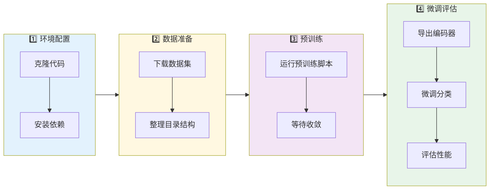
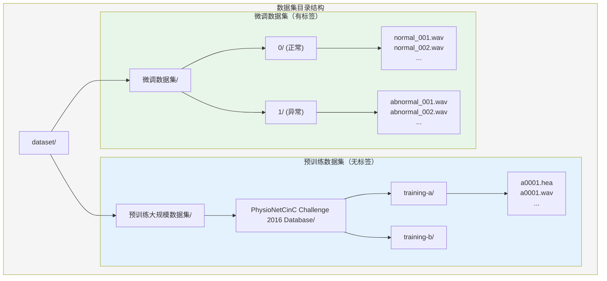
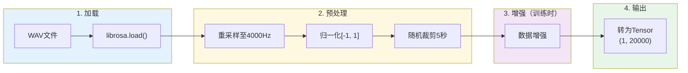
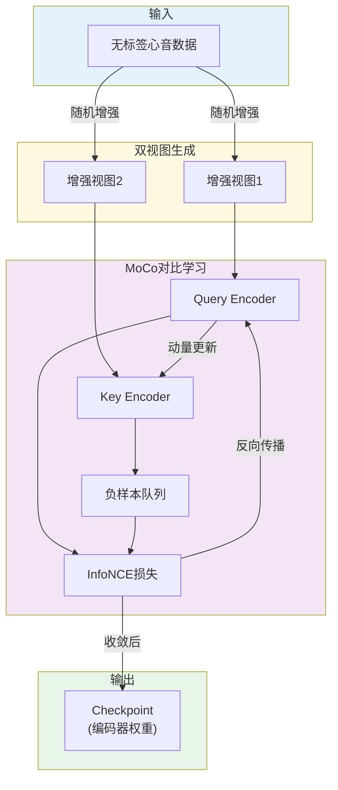

# CNN-Mamba-SSL 使用教程

> **从零开始使用CNN-Mamba自监督学习框架进行心音分类**

---

## 目录

1. [快速开始](#1-快速开始)
2. [环境配置](#2-环境配置)
3. [数据准备](#3-数据准备)
4. [预训练流程](#4-预训练流程)
5. [编码器导出](#5-编码器导出)
6. [微调流程](#6-微调流程)
7. [评估与推理](#7-评估与推理)
8. [高级用法](#8-高级用法)
9. [FAQ与故障排除](#9-faq与故障排除)

---

## 1. 快速开始

### 1.1 5分钟上手流程



### 1.2 最简运行命令

```bash
# 1. 克隆代码
git clone https://github.com/dunkmonkey/CNN-Mamba-SSL.git
cd CNN-Mamba-SSL

# 2. 安装依赖
pip install -r requirements.txt

# 3. 预训练（假设数据已准备好）
python scripts/train_pretrain.py

# 4. 导出编码器
python scripts/export_encoder.py \
    --checkpoint outputs/pretrain/checkpoints/last.ckpt \
    --output pretrained_encoders/encoder.pth

# 5. 微调分类
python scripts/train_finetune.py \
    pretrained_encoder=pretrained_encoders/encoder.pth

# 6. 评估性能
python scripts/evaluate.py \
    checkpoint=outputs/finetune/checkpoints/best.ckpt
```

---

## 2. 环境配置

### 2.1 系统要求

| 要求 | 最低配置 | 推荐配置 |
|------|----------|----------|
| 操作系统 | Ubuntu 18.04+ / Windows 10+ | Ubuntu 20.04+ |
| Python | 3.9+ | 3.10 |
| CUDA | 11.7+ | 12.0+ |
| GPU显存 | 8GB | 16GB+ |
| RAM | 16GB | 32GB+ |
| 磁盘空间 | 10GB | 50GB+ |

### 2.2 安装步骤

#### 方式一：使用pip（推荐）

```bash
# 1. 创建虚拟环境（可选但推荐）
python -m venv venv
source venv/bin/activate  # Linux/Mac
# 或 venv\Scripts\activate  # Windows

# 2. 安装基础依赖
pip install -r requirements.txt

# 3. 安装Mamba-SSM（需要CUDA）
pip install mamba-ssm causal-conv1d

# 4. 验证安装
python -c "import torch; import mamba_ssm; print('✓ 安装成功!')"
```

#### 方式二：使用Conda

```bash
# 1. 创建Conda环境
conda create -n cnn-mamba python=3.10
conda activate cnn-mamba

# 2. 安装PyTorch（选择对应CUDA版本）
conda install pytorch torchvision torchaudio pytorch-cuda=12.1 -c pytorch -c nvidia

# 3. 安装其他依赖
pip install -r requirements.txt
pip install mamba-ssm causal-conv1d
```

#### 方式三：开发模式安装

```bash
# 安装为可编辑包
pip install -e .
```

### 2.3 依赖清单

```
# requirements.txt 核心依赖
torch>=2.0.0
pytorch-lightning>=2.0.0
hydra-core>=1.3.0
omegaconf>=2.3.0
mamba-ssm>=1.0.0
causal-conv1d>=1.0.0
librosa>=0.10.0
soundfile>=0.12.0
torchmetrics>=1.0.0
tensorboard>=2.13.0
scikit-learn>=1.3.0
numpy>=1.24.0
scipy>=1.10.0
pandas>=2.0.0
tqdm>=4.65.0
```

### 2.4 常见安装问题

#### 问题1：Mamba安装失败

**错误信息**：`Building wheel for mamba-ssm failed`

**解决方案**：
```bash
# 方法1：使用预编译包
pip install mamba-ssm --no-build-isolation

# 方法2：指定CUDA架构
TORCH_CUDA_ARCH_LIST="8.0" pip install mamba-ssm

# 方法3：检查ninja是否安装
pip install ninja
pip install mamba-ssm
```

#### 问题2：CUDA版本不匹配

**错误信息**：`CUDA error: no kernel image is available`

**解决方案**：
```bash
# 检查CUDA版本
nvcc --version
nvidia-smi

# 安装匹配的PyTorch
pip install torch --index-url https://download.pytorch.org/whl/cu118  # CUDA 11.8
pip install torch --index-url https://download.pytorch.org/whl/cu121  # CUDA 12.1
```

#### 问题3：显存不足

**解决方案**：
```bash
# 减小batch size和队列大小
python scripts/train_pretrain.py \
    data.batch_size=16 \
    moco.queue_size=16384
```

### 2.5 验证安装

```python
# 运行验证脚本
python -c "
import torch
import pytorch_lightning as pl
import hydra
import librosa
try:
    import mamba_ssm
    print('✓ mamba-ssm 已安装')
except ImportError:
    print('✗ mamba-ssm 未安装')

print(f'✓ PyTorch {torch.__version__}')
print(f'✓ CUDA 可用: {torch.cuda.is_available()}')
if torch.cuda.is_available():
    print(f'✓ GPU: {torch.cuda.get_device_name(0)}')
    print(f'✓ 显存: {torch.cuda.get_device_properties(0).total_memory / 1e9:.1f} GB')
print(f'✓ Lightning {pl.__version__}')
print('✓ 所有核心依赖已就绪!')
"
```

---

## 3. 数据准备

### 3.1 数据集目录结构



### 3.2 PhysioNet 2016数据集

#### 3.2.1 数据集介绍

PhysioNet/CinC Challenge 2016 是心音分类的标准数据集：

| 属性 | 说明 |
|------|------|
| 样本数量 | ~3,000条记录 |
| 采样率 | 2000Hz（原始） |
| 时长 | 5-120秒不等 |
| 类别 | 正常 / 异常 |
| 来源 | 多个临床中心 |

#### 3.2.2 下载数据集

```bash
# 方法1：使用wget下载
cd dataset
mkdir -p "预训练大规模数据集"
cd "预训练大规模数据集"

# 下载PhysioNet 2016数据
wget -r -np -nH --cut-dirs=3 \
    https://physionet.org/files/challenge-2016/1.0.0/

# 方法2：使用physionet-build（推荐）
pip install physionet-build
pb download challenge-2016
```

#### 3.2.3 数据格式

每个心音记录包含两个文件：

**头文件 (.hea)**：
```
a0001 2 2000 71332
a0001.wav 16 1000 16 0 0 0 0 PCG
# Normal
```
- 第1行：记录名、通道数、采样率、样本点数
- 第2行：文件名、位数、增益等
- 第3行：注释（包含标签）

**音频文件 (.wav)**：
- 16位PCM格式
- 单通道
- 采样率2000Hz

### 3.3 微调数据集准备

#### 3.3.1 目录结构

```
dataset/微调数据集/
├── 0/                    # 正常样本
│   ├── normal_001.wav
│   ├── normal_002.wav
│   └── ...
└── 1/                    # 异常样本
    ├── abnormal_001.wav
    ├── abnormal_002.wav
    └── ...
```

#### 3.3.2 使用REFERENCE.csv

如果有标签文件，可以使用以下结构：

```
dataset/微调数据集/
├── REFERENCE.csv         # 标签文件
└── audio/
    ├── sample_001.wav
    ├── sample_002.wav
    └── ...
```

**REFERENCE.csv格式**：
```csv
filename,label
sample_001,-1
sample_002,1
sample_003,-1
```
- `-1`：正常
- `1`：异常

### 3.4 自定义数据集

#### 3.4.1 音频格式要求

| 属性 | 要求 | 建议 |
|------|------|------|
| 格式 | WAV | - |
| 采样率 | 任意（会自动重采样） | 2000-8000Hz |
| 通道 | 单通道 | - |
| 时长 | ≥5秒 | 5-30秒 |
| 位深 | 16位 | - |

#### 3.4.2 创建数据集类

如需使用完全自定义的数据格式，可以继承 `PhysioNetDataset`：

```python
# 创建 src/data/datasets/custom_dataset.py
from src.data.datasets.physionet_dataset import PhysioNetDataset

class CustomDataset(PhysioNetDataset):
    def _find_audio_files(self):
        """自定义音频文件发现逻辑"""
        # 返回音频文件路径列表
        pass
    
    def _load_labels(self):
        """自定义标签加载逻辑"""
        # 返回 {文件路径: 标签} 字典
        pass
```

### 3.5 数据预处理流程



---

## 4. 预训练流程

### 4.1 预训练概述



### 4.2 基础训练命令

```bash
# 使用默认配置进行预训练
python scripts/train_pretrain.py

# 使用实验配置
python scripts/train_pretrain.py experiment=exp001_baseline

# 指定GPU
CUDA_VISIBLE_DEVICES=0 python scripts/train_pretrain.py
```

### 4.3 常用参数调整

```bash
# 调整训练轮数
python scripts/train_pretrain.py trainer.trainer.max_epochs=300

# 调整batch size（显存不足时减小）
python scripts/train_pretrain.py data.batch_size=32

# 调整学习率
python scripts/train_pretrain.py optimizer.optimizer.lr=0.0005

# 调整MoCo参数
python scripts/train_pretrain.py \
    moco.queue_size=32768 \
    moco.temperature=0.05 \
    moco.momentum=0.99

# 调整模型架构
python scripts/train_pretrain.py \
    model.mamba_config.n_layers=6 \
    model.mamba_config.d_model=256
```

### 4.4 完整训练命令示例

```bash
python scripts/train_pretrain.py \
    # 数据配置
    data.batch_size=64 \
    data.num_workers=8 \
    
    # 模型配置
    model.mamba_config.n_layers=4 \
    model.mamba_config.d_model=128 \
    
    # MoCo配置
    moco.queue_size=65536 \
    moco.temperature=0.07 \
    moco.momentum=0.999 \
    
    # 训练配置
    trainer.trainer.max_epochs=200 \
    trainer.trainer.precision=16-mixed \
    trainer.trainer.gradient_clip_val=1.0 \
    
    # 优化器配置
    optimizer.optimizer.lr=0.001 \
    optimizer.optimizer.weight_decay=0.0001 \
    
    # 输出配置
    output_dir=outputs/pretrain_exp1
```

### 4.5 训练输出

训练过程会产生以下输出：

```
outputs/
└── pretrain/
    ├── checkpoints/
    │   ├── epoch=50-val_loss=1.2345.ckpt
    │   ├── epoch=100-val_loss=0.9876.ckpt
    │   └── last.ckpt
    ├── tensorboard/
    │   └── version_0/
    │       └── events.out.tfevents.*
    └── config.yaml              # 保存的配置
```

### 4.6 监控训练进度

#### 使用TensorBoard

```bash
# 启动TensorBoard
tensorboard --logdir outputs/pretrain/tensorboard

# 浏览器访问 http://localhost:6006
```

**监控指标**：
- `train_loss`：训练损失（应逐渐下降）
- `val_loss`：验证损失（监控过拟合）
- `train_acc_top1`：Top-1准确率
- `train_acc_top5`：Top-5准确率
- `learning_rate`：学习率变化

### 4.7 断点续训

```bash
# 从checkpoint恢复训练
python scripts/train_pretrain.py \
    trainer.trainer.resume_from_checkpoint=outputs/pretrain/checkpoints/last.ckpt
```

---

## 5. 编码器导出

### 5.1 为什么需要导出？

MoCo训练产生的checkpoint包含：
- Query Encoder（用于下游任务）
- Key Encoder（仅训练使用）
- 负样本队列（仅训练使用）
- 优化器状态（仅训练使用）

微调时只需要Query Encoder的**主干网络**（不含投影头）。

### 5.2 导出命令

```bash
# 基础导出
python scripts/export_encoder.py \
    --checkpoint outputs/pretrain/checkpoints/last.ckpt \
    --output pretrained_encoders/encoder.pth

# 指定输出目录
python scripts/export_encoder.py \
    --checkpoint outputs/pretrain/checkpoints/epoch=200-val_loss=0.7890.ckpt \
    --output pretrained_encoders/cnn_mamba_epoch200.pth
```

### 5.3 导出内容

导出的 `.pth` 文件包含：

```python
{
    'encoder_state_dict': {...},  # 编码器权重
    'config': {...},              # 模型配置
    'pretrain_epochs': 200,       # 预训练轮数
    'pretrain_loss': 0.789        # 最终损失
}
```

### 5.4 验证导出

```python
import torch
from src.models.encoders.hybrid_encoder import HybridEncoder

# 加载导出的编码器
checkpoint = torch.load('pretrained_encoders/encoder.pth')

# 创建编码器并加载权重
encoder = HybridEncoder(**checkpoint['config'])
encoder.load_state_dict(checkpoint['encoder_state_dict'])

# 测试前向传播
x = torch.randn(1, 1, 20000)
features = encoder(x)
print(f"输出形状: {features.shape}")  # 应为 (1, 128)
```

---

## 6. 微调流程

### 6.1 微调策略对比


| 策略 | 优势 | 劣势 | 适用场景 |
|------|------|------|----------|
| **Linear Probing** | 快速，不易过拟合 | 可能欠拟合 | 数据量少（<100），快速评估 |
| **Full Fine-tuning** | 性能最优 | 可能过拟合 | 数据量充足（>100） |

### 6.2 Linear Probing（冻结编码器）

```bash
python scripts/train_finetune.py \
    pretrained_encoder=pretrained_encoders/encoder.pth \
    trainer.freeze_encoder=true \
    trainer.trainer.max_epochs=100
```

### 6.3 Full Fine-tuning（端到端训练）

```bash
python scripts/train_finetune.py \
    pretrained_encoder=pretrained_encoders/encoder.pth \
    trainer.freeze_encoder=false \
    trainer.encoder_lr_multiplier=0.01 \
    trainer.trainer.max_epochs=100
```

**参数说明**：
- `freeze_encoder=false`：允许更新编码器权重
- `encoder_lr_multiplier=0.01`：编码器使用1%的学习率，避免破坏预训练特征

### 6.4 微调配置详解

```bash
python scripts/train_finetune.py \
    # 预训练编码器
    pretrained_encoder=pretrained_encoders/encoder.pth \
    
    # 微调策略
    trainer.freeze_encoder=false \
    trainer.encoder_lr_multiplier=0.01 \
    
    # 数据配置
    data.data_dir=dataset/微调数据集 \
    data.batch_size=32 \
    data.train_ratio=0.7 \
    data.val_ratio=0.15 \
    data.test_ratio=0.15 \
    
    # 训练配置
    trainer.trainer.max_epochs=100 \
    trainer.trainer.precision=16-mixed \
    
    # 优化器配置
    optimizer.optimizer.lr=0.001 \
    optimizer.optimizer.weight_decay=0.0001 \
    
    # 分类器配置
    classifier.num_classes=2 \
    classifier.hidden_dims=[64] \
    classifier.dropout=0.3 \
    
    # 输出
    output_dir=outputs/finetune_exp1
```

### 6.5 分类器架构

```python
# 默认分类器结构
Encoder Output (128)
    ↓
Linear(128, 64) + ReLU + Dropout(0.3)
    ↓
Linear(64, 2)  # 二分类
    ↓
Softmax → [P(正常), P(异常)]
```

### 6.6 微调输出

```
outputs/finetune/
├── checkpoints/
│   ├── epoch=50-val_f1=0.8765.ckpt
│   └── best.ckpt
├── tensorboard/
│   └── version_0/
└── config.yaml
```

---

## 7. 评估与推理

### 7.1 运行评估

```bash
# 评估微调后的模型
python scripts/evaluate.py \
    checkpoint=outputs/finetune/checkpoints/best.ckpt

# 指定测试数据
python scripts/evaluate.py \
    checkpoint=outputs/finetune/checkpoints/best.ckpt \
    data.data_dir=dataset/测试数据集
```

### 7.2 评估输出

```
============================================================
                    评估报告
============================================================

分类报告:
              precision    recall  f1-score   support

      Normal       0.92      0.88      0.90       120
    Abnormal       0.94      0.96      0.95       180

    accuracy                           0.93       300
   macro avg       0.93      0.92      0.93       300
weighted avg       0.93      0.93      0.93       300

混淆矩阵:
[[106  14]
 [  7 173]]

详细指标:
- Accuracy:    0.9300
- Precision:   0.9251
- Recall:      0.9611
- F1 Score:    0.9428
- AUROC:       0.9650
- Sensitivity: 0.9611
- Specificity: 0.8833

============================================================
```

### 7.3 指标解读

| 指标 | 含义 | 期望值 |
|------|------|--------|
| **Accuracy** | 整体准确率 | >0.85 |
| **Precision** | 预测为阳性中真正阳性的比例 | >0.85 |
| **Recall/Sensitivity** | 实际阳性中被正确识别的比例 | >0.90 |
| **Specificity** | 实际阴性中被正确识别的比例 | >0.85 |
| **F1 Score** | Precision和Recall的调和平均 | >0.85 |
| **AUROC** | ROC曲线下面积 | >0.90 |

### 7.4 单样本推理

```python
import torch
import librosa
from src.models.classifier_module import ClassifierModule

# 加载模型
model = ClassifierModule.load_from_checkpoint('outputs/finetune/checkpoints/best.ckpt')
model.eval()

# 加载并预处理音频
audio, sr = librosa.load('test_audio.wav', sr=4000)
audio = audio[:20000]  # 取5秒
audio = torch.tensor(audio).unsqueeze(0).unsqueeze(0)  # (1, 1, 20000)

# 推理
with torch.no_grad():
    logits = model(audio)
    probs = torch.softmax(logits, dim=1)
    pred = torch.argmax(probs, dim=1)

print(f"预测类别: {'异常' if pred.item() == 1 else '正常'}")
print(f"置信度: {probs[0, pred.item()].item():.2%}")
```

### 7.5 批量推理

```python
import os
import torch
from torch.utils.data import DataLoader
from src.data.datasets.physionet_dataset import PhysioNetDataset

# 创建测试数据集
test_dataset = PhysioNetDataset(
    data_dir='dataset/测试数据/',
    target_sr=4000,
    segment_length=5.0
)

test_loader = DataLoader(test_dataset, batch_size=32, shuffle=False)

# 批量推理
all_preds = []
all_probs = []

model.eval()
with torch.no_grad():
    for batch in test_loader:
        audio = batch['audio']
        logits = model(audio)
        probs = torch.softmax(logits, dim=1)
        preds = torch.argmax(probs, dim=1)
        
        all_preds.extend(preds.tolist())
        all_probs.extend(probs[:, 1].tolist())  # 异常概率

# 保存结果
import pandas as pd
results = pd.DataFrame({
    'prediction': all_preds,
    'abnormal_prob': all_probs
})
results.to_csv('predictions.csv', index=False)
```

---

## 8. 高级用法

### 8.1 消融实验

比较不同编码器架构：

```bash
# 多配置扫描
python scripts/train_pretrain.py -m \
    model=cnn_only,mamba_only,cnn_mamba \
    seed=42,123,456

# 使用消融实验配置
python scripts/train_pretrain.py experiment=exp002_ablation
```

### 8.2 超参数搜索

```bash
# 学习率搜索
python scripts/train_pretrain.py -m \
    optimizer.optimizer.lr=0.0001,0.0005,0.001,0.005

# 温度参数搜索
python scripts/train_pretrain.py -m \
    moco.temperature=0.05,0.07,0.1,0.2

# 组合搜索
python scripts/train_pretrain.py -m \
    optimizer.optimizer.lr=0.0005,0.001 \
    moco.temperature=0.05,0.07 \
    moco.queue_size=32768,65536
```

### 8.3 多GPU训练

```bash
# 自动检测GPU
python scripts/train_pretrain.py \
    trainer.trainer.devices=auto \
    trainer.trainer.strategy=ddp

# 指定GPU
CUDA_VISIBLE_DEVICES=0,1 python scripts/train_pretrain.py \
    trainer.trainer.devices=2 \
    trainer.trainer.strategy=ddp

# 使用FSDP（大模型）
python scripts/train_pretrain.py \
    trainer.trainer.strategy=fsdp
```

### 8.4 混合精度训练

```bash
# FP16混合精度（推荐）
python scripts/train_pretrain.py \
    trainer.trainer.precision=16-mixed

# BF16混合精度（A100/H100）
python scripts/train_pretrain.py \
    trainer.trainer.precision=bf16-mixed

# FP32全精度（调试用）
python scripts/train_pretrain.py \
    trainer.trainer.precision=32
```

### 8.5 自定义增强策略

修改 `configs/augmentation/pcg_augmentations.yaml`：

```yaml
# 禁用某些增强
time_warp:
  enabled: false

# 调整增强强度
gaussian_noise:
  enabled: true
  prob: 0.7                    # 提高概率
  noise_level_range: [0.005, 0.02]  # 增大噪声

# 调整低通滤波
lowpass_filter:
  enabled: true
  prob: 0.8                    # 这是最关键的增强
  cutoff_freq_range: [150, 600]  # 扩大范围
```

### 8.6 模型架构调整

```bash
# 增加Mamba层数
python scripts/train_pretrain.py \
    model.mamba_config.n_layers=6 \
    model.mamba_config.d_model=256

# 增加CNN通道数
python scripts/train_pretrain.py \
    model.cnn_config.out_channels=[64,128,256]

# 增大投影头
python scripts/train_pretrain.py \
    model.projection_config.hidden_dim=256 \
    model.projection_config.output_dim=256
```

### 8.7 使用WandB监控（可选）

```bash
# 安装wandb
pip install wandb

# 登录
wandb login

# 使用wandb logger
python scripts/train_pretrain.py \
    trainer.logger=wandb \
    trainer.logger.project=cnn-mamba-ssl \
    trainer.logger.name=exp001
```

### 8.8 导出ONNX模型

```python
import torch
from src.models.encoders.hybrid_encoder import HybridEncoder

# 加载模型
checkpoint = torch.load('pretrained_encoders/encoder.pth')
encoder = HybridEncoder(**checkpoint['config'])
encoder.load_state_dict(checkpoint['encoder_state_dict'])
encoder.eval()

# 导出ONNX
dummy_input = torch.randn(1, 1, 20000)
torch.onnx.export(
    encoder,
    dummy_input,
    'encoder.onnx',
    input_names=['audio'],
    output_names=['features'],
    dynamic_axes={
        'audio': {0: 'batch_size'},
        'features': {0: 'batch_size'}
    }
)
print("ONNX模型已导出!")
```

---

## 9. FAQ与故障排除

### 9.1 常见问题

#### Q1: 训练损失不下降怎么办？

**可能原因与解决方案**：

| 原因 | 解决方案 |
|------|----------|
| 学习率过大 | 减小学习率：`optimizer.optimizer.lr=0.0001` |
| 学习率过小 | 增大学习率：`optimizer.optimizer.lr=0.005` |
| 数据增强过强 | 降低增强概率 |
| 模型过大 | 减少Mamba层数 |
| 数据量太少 | 增加数据或使用更小的模型 |

#### Q2: 验证损失上升（过拟合）怎么办？

**解决方案**：
```bash
# 增加正则化
python scripts/train_pretrain.py \
    model.mamba_config.dropout=0.2 \
    optimizer.optimizer.weight_decay=0.001

# 使用早停
python scripts/train_pretrain.py \
    trainer.callbacks.early_stopping.patience=10
```

#### Q3: 显存不足 (Out of Memory)？

**解决方案**：
```bash
# 减小batch size
python scripts/train_pretrain.py data.batch_size=16

# 减小队列大小
python scripts/train_pretrain.py moco.queue_size=16384

# 使用梯度累积
python scripts/train_pretrain.py \
    trainer.trainer.accumulate_grad_batches=4 \
    data.batch_size=16  # 等效batch=64

# 使用混合精度
python scripts/train_pretrain.py trainer.trainer.precision=16-mixed
```

#### Q4: 微调效果差怎么办？

**可能原因与解决方案**：

| 原因 | 解决方案 |
|------|----------|
| 预训练不充分 | 增加预训练轮数 |
| 微调数据太少 | 使用Linear Probing |
| 学习率不当 | 调整encoder_lr_multiplier |
| 类别不平衡 | 使用加权损失函数 |

#### Q5: 如何判断预训练是否成功？

**观察指标**：
1. 训练损失稳定下降
2. Top-1准确率持续提升（目标>60%）
3. Top-5准确率持续提升（目标>85%）
4. 验证损失与训练损失接近（无严重过拟合）

### 9.2 错误信息排查

#### 错误: `mamba_ssm not found`

```bash
# 解决方案
pip install mamba-ssm causal-conv1d
```

#### 错误: `CUDA out of memory`

```bash
# 减小batch size
data.batch_size=16

# 或清理GPU缓存
python -c "import torch; torch.cuda.empty_cache()"
```

#### 错误: `FileNotFoundError: No audio files found`

检查数据目录路径是否正确：
```bash
# 查看实际数据目录
ls -la dataset/预训练大规模数据集/
```

#### 错误: `RuntimeError: shape mismatch`

检查音频预处理参数是否一致：
```yaml
# 确保预训练和微调使用相同配置
data.target_sr: 4000
data.segment_length: 5.0
data.n_samples: 20000
```

#### 错误: `KeyError: 'encoder_q'`

加载方式不正确，使用正确的方法：
```python
# 错误
model = torch.load('checkpoint.ckpt')

# 正确
from src.models.moco_module import MoCoModule
model = MoCoModule.load_from_checkpoint('checkpoint.ckpt')
```

### 9.3 性能优化建议

#### 加速数据加载

```bash
# 增加worker数量
python scripts/train_pretrain.py data.num_workers=8

# 使用内存映射
python scripts/train_pretrain.py data.pin_memory=true
```

#### 加速训练

```bash
# 使用混合精度
trainer.trainer.precision=16-mixed

# 使用编译模型（PyTorch 2.0+）
trainer.trainer.compile=true

# 梯度检查点（节省显存，略慢）
model.use_gradient_checkpointing=true
```

#### 加速评估

```bash
# 使用更大batch
python scripts/evaluate.py data.batch_size=128

# 使用FP16推理
python scripts/evaluate.py precision=16
```

### 9.4 调试技巧

#### 快速验证代码

```bash
# 只运行1个epoch
python scripts/train_pretrain.py \
    trainer.trainer.max_epochs=1 \
    trainer.trainer.limit_train_batches=10 \
    trainer.trainer.limit_val_batches=5
```

#### 检查数据

```python
from src.data.datamodules.pretrain_datamodule import PretrainDataModule

dm = PretrainDataModule(data_dir='dataset/...', batch_size=4)
dm.setup('fit')

# 查看一个batch
batch = next(iter(dm.train_dataloader()))
view1, view2 = batch
print(f"View1 shape: {view1.shape}")
print(f"View2 shape: {view2.shape}")
```

#### 可视化增强效果

```python
import matplotlib.pyplot as plt
from src.data.datasets.augmentations import PCGAugmentationPipeline

# 加载原始音频
audio, sr = librosa.load('sample.wav', sr=4000)

# 应用增强
pipeline = PCGAugmentationPipeline(...)
augmented = pipeline(audio)

# 绘制对比
fig, axes = plt.subplots(2, 1, figsize=(12, 6))
axes[0].plot(audio)
axes[0].set_title('Original')
axes[1].plot(augmented)
axes[1].set_title('Augmented')
plt.tight_layout()
plt.savefig('augmentation_comparison.png')
```

---

## 附录

### A. 完整配置参数表

| 配置路径 | 类型 | 默认值 | 说明 |
|----------|------|--------|------|
| **数据配置** |
| `data.data_dir` | str | `dataset/...` | 数据目录 |
| `data.target_sr` | int | 4000 | 目标采样率 |
| `data.segment_length` | float | 5.0 | 片段长度(秒) |
| `data.batch_size` | int | 64 | 批次大小 |
| `data.num_workers` | int | 4 | 数据加载线程 |
| **模型配置** |
| `model.cnn_config.out_channels` | list | [32,64,128] | CNN通道数 |
| `model.cnn_config.kernel_sizes` | list | [16,8,4] | 卷积核大小 |
| `model.cnn_config.dropout` | float | 0.1 | Dropout率 |
| `model.mamba_config.d_model` | int | 128 | 隐藏维度 |
| `model.mamba_config.n_layers` | int | 4 | Mamba层数 |
| `model.mamba_config.d_state` | int | 16 | 状态维度 |
| **MoCo配置** |
| `moco.queue_size` | int | 65536 | 队列大小 |
| `moco.momentum` | float | 0.999 | 动量系数 |
| `moco.temperature` | float | 0.07 | 温度参数 |
| **训练配置** |
| `trainer.trainer.max_epochs` | int | 200 | 最大轮数 |
| `trainer.trainer.precision` | str | 16-mixed | 精度 |
| `trainer.trainer.gradient_clip_val` | float | 1.0 | 梯度裁剪 |
| **优化器配置** |
| `optimizer.optimizer.lr` | float | 0.001 | 学习率 |
| `optimizer.optimizer.weight_decay` | float | 0.0001 | 权重衰减 |

### B. 命令速查

```bash
# 预训练
python scripts/train_pretrain.py

# 导出编码器
python scripts/export_encoder.py --checkpoint <ckpt> --output <out>

# Linear Probing
python scripts/train_finetune.py pretrained_encoder=<path> trainer.freeze_encoder=true

# Full Fine-tuning
python scripts/train_finetune.py pretrained_encoder=<path> trainer.freeze_encoder=false

# 评估
python scripts/evaluate.py checkpoint=<path>

# 消融实验
python scripts/train_pretrain.py -m model=cnn_only,mamba_only,cnn_mamba

# TensorBoard
tensorboard --logdir outputs/
```

### C. 相关资源

- **项目技术文档**: [PROJECT_DOCUMENTATION.md](PROJECT_DOCUMENTATION.md)
- **快速开始**: [QUICKSTART.md](QUICKSTART.md)
- **技术原理**: [doc/融合Mamba与CNN的心音信号自监督表征学习研究：实现前提与原理.md](doc/融合Mamba与CNN的心音信号自监督表征学习研究：实现前提与原理.md)
- **PhysioNet 2016**: https://physionet.org/content/challenge-2016/1.0.0/
- **Mamba论文**: https://arxiv.org/abs/2312.00752
- **MoCo论文**: https://arxiv.org/abs/1911.05722

---

> **文档版本**: 1.0  
> **最后更新**: 2024年12月  
> **问题反馈**: 请在GitHub Issues中提交
