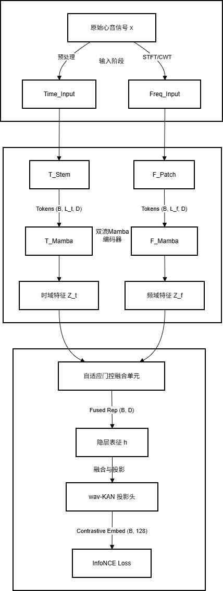

# **基于双流时频Mamba与wav-KAN的心音自监督表征学习**

## **网络架构详细设计说明**

本章节将详细阐述双流时频Mamba架构的具体规格，确保设计方案的可复现性与工程可行性。

### **总体架构概览**

系统由两个并行的编码器分支组成：处理原始波形的时域流（Time-Stream）和处理梅尔声谱图的频域流（Freq-Stream）。两者在深层通过自适应门控融合单元（Adaptive Gated Fusion Unit）进行特征整合，最终通过wav-KAN投影头输出用于对比学习的特征向量。

 概念架构图解  
\[输入心音 x (5s, 2000Hz)\]  
│  
├──────────────────────────────┐  
▼ ▼  
\[时域预处理\]  
│ │  
▼ ▼  
\[分支A: 时域流 Mamba\]  
(1D-CNN Tokenizer) (垂直条带 Patch Embed)  
│ │  
▼ ▼  
\[双向 Mamba 编码器 x4\] \[双向 Mamba 编码器 x4\]  
│ │  
▼ ▼  
\[LayerNorm\] \[LayerNorm\]  
│ │  
│ \[转置卷积上采样对齐\]  
│ │  
└──────────────┬───────────────┘  
▼  
\[自适应门控融合单元 (GMU)\]  
│  
▼  
\[融合特征向量 z\]  
│  
▼  
\[wav-KAN 投影头\]  
│  
▼  
\[InfoNCE Loss\]

### **分支一：时域流编码器 (Time-Stream Encoder)**

时域流的设计目标是保留微秒级的瞬态变化，这对于分辨S2分裂（通常间隔30-50ms）或区分开瓣音与第三心音至关重要。

* **输入规范**：原始波形 $X\_{time} \\in \\mathbb{R}^{1 \\times 10000}$。采样率设定为2000Hz，时长5秒。这一采样率足以覆盖绝大多数心音的频率范围（20-1000Hz），同时避免了过高采样率带来的计算冗余 9。  
* Tokenizer (层级降采样前端)：  
  为将长序列压缩至Mamba的高效处理区间，同时保留时序细节，采用3层1D-CNN设计：  
  * **Layer 1**: Conv1d(k=25, s=4, p=12, c=32)。大卷积核（约12.5ms）用于捕捉基础波形轮廓，4倍下采样将长度降至2500。  
  * **Layer 2**: Conv1d(k=25, s=4, p=12, c=64)。再次4倍下采样，长度降至625。  
  * **Layer 3**: Conv1d(k=3, s=1, p=1, c=128)。在不降低分辨率的情况下增加特征通道数，增强特征表达能力。  
  * **输出序列**：$L\_{time} \= 625$ tokens。每个token代表原始信号中的 $16$ 个样本点（即8ms）。这一时间分辨率远高于传统的基于帧的声谱图分析，确保了对瞬态事件的捕捉能力。  
* **Backbone (骨干网络)**：4层 **双向 Mamba (Bi-Mamba)**。  
  * 鉴于心音信号在诊断上的“非因果性”（例如，判断收缩期杂音需要同时参考前后的S1和S2心音），单向扫描无法充分利用上下文信息。因此，采用双向Mamba模块，分别进行前向和后向扫描，并对其输出进行拼接或门控融合 1。  
  * 配置参数：d\_model=128, d\_state=16, d\_conv=4, expand=2。

### **分支二：频域流编码器 (Freq-Stream Encoder)**

频域流专注于捕捉声谱图中的能量纹理分布，这对识别心脏杂音（如收缩期喷射性杂音的菱形包络）至关重要。

* **输入规范**：Log-Mel 语谱图 $X\_{freq} \\in \\mathbb{R}^{64 \\times 500}$。  
  * 参数设置：Window size \= 25ms, Hop length \= 10ms, Mel bins \= 64。这种设置在语音和生物声学处理中是标准的，能够平衡时频分辨率 11。  
* **Tokenizer (垂直条带切分 Patch Embedding)**：  
  * 借鉴AST的设计，但为了保持频率维度的完整性（频率轴上的位置具有明确的物理意义，不应像图像那样随意切分），采用 **垂直条带（Vertical Strip）** 切分策略。  
  * Conv2d(in=1, out=128, kernel=(64, 4), stride=(64, 4))。  
  * 该卷积核一次性覆盖所有64个Mel频段，并在时间轴上每4帧（40ms）移动一步。  
  * **输出序列**：$L\_{freq} \= 500 / 4 \= 125$ tokens。每个token包含40ms内的完整频谱特征。  
* **位置编码**：加入可学习的一维位置编码 (Learnable 1D Positional Embedding)，以保留序列的时序信息。  
* **Backbone**：4层 **双向 Mamba (Bi-Mamba)**，配置与时域流相同，确保两个流在深层特征空间的维度一致性。

### **融合模块：自适应门控融合 (Adaptive Gated Fusion)**

由于时域流 ($L=625$) 和频域流 ($L=125$) 的序列长度不同，直接拼接不可行。本方案设计了一个包含对齐与门控的融合模块。

* **上采样对齐 (Upsampling Alignment)**：  
  * 为了不丢失时域流的高分辨率信息，我们将频域流特征 $Z\_{freq}$ 上采样至时域流长度。  
  * 使用 **转置卷积 (Transposed Conv1d)**：ConvTranspose1d(in=128, out=128, kernel=5, stride=5)。这将 $125$ 个token扩展为 $625$ 个，使其与 $Z\_{time}$ 对齐。  
* **门控机制 (Gated Multimodal Unit, GMU)**：  
  * 单纯的相加或拼接无法体现不同模态在不同时刻的重要性。例如，在S1/S2发生时，时域波形的陡峭度更具判别力；而在杂音持续期间，频域的纹理更重要。  
  * 引入门控机制 12：

    $$G \= \\sigma(Linear(\[Z\_{time} ; Z\_{freq}^{up}\]))$$  
    $$Z\_{fused} \= G \\odot Z\_{time} \+ (1-G) \\odot Z\_{freq}^{up}$$  
  * 其中 $\\sigma$ 为Sigmoid函数，生成 $(0, 1)$ 之间的权重掩码。该机制允许模型动态地、逐时间步地选择信赖哪个模态的特征。

### **投影头创新：wav-KAN Head**

这是本架构对传统SSL框架的重大改进。

* **传统瓶颈**：MoCo等框架通常使用 MLP (Linear-ReLU-Linear) 作为投影头。然而，MLP在处理高维流形时存在效率低下的问题，且缺乏对信号局部特征的显式建模能力。  
* **wav-KAN 设计**：  
  * 利用 Kolmogorov-Arnold 网络的可学习激活函数特性，结合小波基函数。  
  * **基函数**：选用 **Mexican Hat (Ricker)** 小波。其数学形式为 $\\psi(t) \= \\frac{2}{\\sqrt{3}\\pi^{1/4}} (1 \- t^2) e^{-t^2/2}$ 6。这种小波是高斯函数的二阶导数，具有良好的带通特性和时域局部化能力，非常适合捕捉心音中的边缘和瞬态特征。  
  * **网络配置**：Input(128) $\\rightarrow$ KAN-Layer(1024, wavelet='mexican\_hat') $\\rightarrow$ KAN-Layer(128)。  
  * **优势**：wav-KAN 能够在潜在空间中更好地逼近心音特征的复杂拓扑结构，增强对比学习中正负样本的可分离性，同时小波的稀疏性有助于抑制背景噪声 7。

### **数据增强库 (Augmentation Library)**

数据增强是SSL成功的关键。针对心音信号，我们设计了严格的增强策略：

* **时域增强**：高斯噪声注入、随机增益（模拟不同采集设备的音量差异）。  
* **频域增强**：采用 **SpecAugment** 20。  
  * **频率掩码**：随机掩盖 $F=20$ 个连续频段。这迫使模型不依赖特定的频率特征（如某些设备引入的工频干扰）。  
  * **时间掩码**：随机掩盖 $T=40$ 帧。模拟短暂的信号丢失或伪影。  
* **禁忌操作**：严禁使用 **Pitch Shift**（音高偏移）。心音的频率特征（如音调高低）直接对应病理类型（如隆隆样杂音 vs. 吹风样杂音），改变音高会破坏病理语义 22。

### **下游任务微调与评估**

预训练完成后，丢弃 wav-KAN 投影头（或作为初始化），在融合特征 $Z\_{fused}$ 后接线性分类器进行微调。

* **任务 1：心杂音检测 (PhysioNet 2022\)**  
  * **目标**：三分类（Present/Absent/Unknown）。  
  * 评估指标：加权准确率 (Weighted Accuracy)。根据比赛规则，假阴性（漏诊）的代价远高于假阳性。公式为：

    $$Acc\_{weighted} \= \\frac{5m\_{PP} \+ 3m\_{UU} \+ m\_{AA}}{5(m\_{PP} \+ m\_{UP} \+ m\_{AP}) \+ \\dots}$$

    其中 $m\_{PP}$ 为真阳性，$m\_{AA}$ 为真阴性。权重因子5强调了对阳性病例的识别能力 17。  
* **任务 2：二分类筛查 (PhysioNet 2016\)**  
  * **目标**：正常 vs. 异常。  
  * **评估指标**：敏感性 (Se) 与特异性 (Sp) 的均值 $(Se+Sp)/2$ 23。

## **消融实验计划 (Ablation Studies)**

消融实验是论文的核心加分项，旨在解构各组件的贡献。

1. **架构消融**：  
   * 仅时域流 (Time-Only Mamba) vs. 仅频域流 (Freq-Only Mamba) vs. 双流 (Dual-Stream)。  
   * **预期结果**：双流架构应显著优于单流，证明时频特征的互补性。  
2. **融合机制消融**：  
   * 直接拼接 (Concatenation) vs. 自适应门控融合 (Gated Fusion)。  
   * **预期结果**：门控融合更优，证明动态权重分配的重要性。  
3. **投影头消融**：  
   * 标准 MLP Head vs. wav-KAN Head。  
   * **预期结果**：wav-KAN 在线性探测（Linear Probing）准确率上更高，证明其在特征空间映射上的优越性。  
4. **序列长度敏感性**：  
   * 测试不同Tokenizer步长（stride）导致的序列长度（如300 vs 600 vs 1200）对性能和显存的影响。  
   * **预期结果**：Mamba架构在长序列下显存占用呈线性增长，而AST呈二次方增长，证明Mamba的效率优势。
